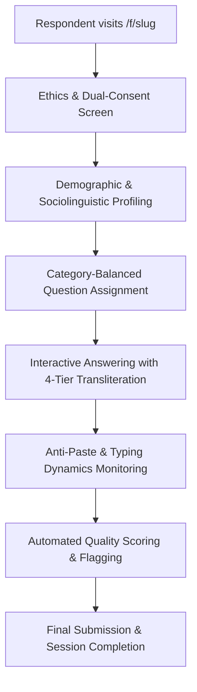
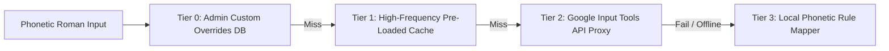

# Marathi Corpus Collection Platform (मराठी भाषा संग्रह)
## Comprehensive Architecture & Implementation Status Report

> **Document Status**: Complete Record of Features Implemented, System Architecture & Operational Workflows  
> **Repository**: `marathi-corpus-collection`  
> **Last Updated**: 2026-09-17  

---

## 1. Executive Summary

The **Marathi Corpus Collection Platform** is a specialized, academic-grade web platform engineered to crowdsource, curate, benchmark, and export authentic native Marathi text datasets. Low-resource Indic language NLP has traditionally suffered from low-quality web-scraped corpora, synthetic machine translations, and excessive Latin code-mixing.

This platform bridges that gap by enabling native speakers across all regions and socio-demographic strata of Maharashtra to contribute natural text. Built-in mechanisms handle **phonetic typing without translation**, **prevent copy-paste cheating**, **profile dialects down to the taluka level**, **track micro-typing kinetics**, and **provide automated linguistic quality filtering** alongside complete academic export pipelines.

---

## 2. Technology Stack & Frameworks

| Component | Technology | Version / Details | Purpose |
| :--- | :--- | :--- | :--- |
| **Framework** | **Next.js (App Router)** | `16.1.6` with React 19 | Server Components, dynamic routes (`/f/[slug]`), and API Route Handlers. |
| **Language** | **TypeScript** | `^5.0.0` | Strict end-to-end typing across DB models, APIs, and client forms. |
| **Database & ORM** | **Drizzle ORM + SQLite (`@libsql/client`)** | `0.45.1` / `0.17.2` | Local fast SQLite development with seamless portability to Turso serverless cloud. |
| **Authentication** | **NextAuth.js v5** | `5.0.0-beta.32` | JWT credential-based sessions for administrator portal protection via edge `middleware.ts`. |
| **Styling & UI** | **Tailwind CSS v4 + Base UI / Radix primitives** | Tailwind `^4.0` | Academic slate-blue color palette in OKLCH color space, Devanagari typography, responsive mobile design. |
| **Analytics & Viz** | **Recharts** | `^2.15.4` | Administrative dashboards, category breakdowns, 30-day submission curves, and quality metrics. |
| **Data Validation** | **Zod** | `^4.3.6` | Strict runtime payload validation for submissions, questions, forms, and overrides. |

---

## 3. Detailed Architecture of What Has Been Implemented

### 3.1. Public Respondent Workflow (`/f/[slug]`)

The respondent portal is designed for high-friction-free mobile browser participation.



1. **Dual Research & AI Consent (Ethics Compliance)**:
   - Respondents must review and grant dual-check consent:
     - **Non-Commercial Academic Research Consent**: Permission to publish in research papers and corpora.
     - **Open AI / LLM Training Consent**: Explicit permission for model training and fine-tuning.
   - Timestamps and explicit boolean values are logged directly into the database.

2. **Sociolinguistic & Geographic Profiling (`MetadataForm.tsx`)**:
   - **Comprehensive District Coverage**: All **36 Maharashtra districts** plus an *"Outside Maharashtra"* option.
   - **Hierarchical Taluka Mapping**: Integrated database of hundreds of talukas dynamically filtered when a district is chosen (e.g., Pune $\to$ Haveli, Baramati, Junnar, etc.).
   - **8+ Dialect Identifiers**: Standard Marathi (*प्रमाण मराठी*), Varhadi (*वऱ्हाडी*), Khandeshi/Ahirani (*अहिराणी*), Konkani (*कोकणी*), Malvani (*मालवणी*), Marathwada (*मराठवाडी*), Kolhapuri/Chandgadi (*कोल्हापुरी*), Deshi (*देशी*), and Other.
   - **Demographic Dimensions**: Age bracket, gender, educational attainment, occupation, and native-speaker self-verification.

3. **Seeded Random Question Assignment (`randomAssignment.ts`)**:
   - Assigns a balanced distribution of questions per session based on rules set in the Form Builder (e.g., 1 Opinion, 1 Experience, 1 Descriptive).
   - Seeded using the respondent's `sessionId`, ensuring that if a mobile browser reloads or network drops, the respondent receives the exact same questions upon restoring.

4. **Concise, Low-Cognitive Load Question Bank**:
   - Prompts calibrated for mobile respondents (target: 8–50 words, 1–2 focused sentences).
   - Eliminates mobile typing fatigue while capturing clean colloquial syntax.

5. **Anti-Paste & Anti-Cheat Safeguards**:
   - Intercepts and blocks clipboard paste (`Ctrl+V`, mobile long-press paste) and drag-and-drop actions in the response area.
   - Real-time warning alert displayed to the respondent.
   - Every paste attempt is counted and logged per question and session in `responseQualityMetrics`.

6. **Typing Kinetics & Dynamics Tracking**:
   - Tracks keystroke events in real time:
     - `totalDurationMs`: Total elapsed time spent on the question.
     - `activeDurationMs`: Cumulative time spent actively keying strokes.
     - `idleDurationMs`: Latency periods reflecting thinking/pauses.
     - `typingSpeedWpm`: Effective Words Per Minute.
     - `wordsTyped` and `charsTyped`.

7. **Word Requirement Progress Ring (`WordProgressRing.tsx`)**:
   - SVG visual ring indicating word-count progression toward the minimum required threshold with responsive color cues (amber $\to$ green).

---

### 3.2. 4-Tier Zero-Friction Marathi Transliteration Engine

Respondents can type phonetically in Roman script (e.g., `kuthe` $\to$ `कुठे`, `namaskar` $\to$ `नमस्कार`) without generating English translations (e.g., `where` does **not** become `कुठे`).



- **Tier 0 (Admin Overrides)**: Instant database-driven custom dictionary overrides managed in the admin portal (`/admin/dictionary`). Used for rare slang, idioms, or custom dialect spellings.
- **Tier 1 (High-Frequency Memory Cache - `<1ms`)**: Pre-compiled hash map of the top 300+ most frequent conversational Marathi words (`src/lib/transliteration/highFreqCache.ts`).
- **Tier 2 (Google Input Tools Proxy - `50-120ms`)**: Server-side proxy (`/api/transliterate`) hitting `https://inputtools.google.com/request?itc=mr-t-i0-und` with LRU caching to eliminate repeated external requests.
- **Tier 3 (Local Phonetic Mapper - `<1ms`)**: Deterministic local rule-based consonant-vowel-matra converter (`src/lib/transliteration/mapper.ts`), ensuring zero failure if network or external APIs drop.
- **Key Ergonomic Features**:
  - **Spacebar / Punctuation Auto-Commit**: Converts words automatically on Space, comma, period, question mark, or Enter.
  - **Candidate Selection Bar**: Touch-friendly pill bar with keyboard navigation (`ArrowUp`/`ArrowDown`/`Enter`) and `onTouchStart` prevent-default to preserve virtual keyboard focus.
  - **Smart Backspace Undo**: Pressing Backspace right after conversion reverts Devanagari back to the typed English word.
  - **Devanagari Passthrough**: Ignores already-Devanagari Unicode input (`[\u0900-\u097F]`) to prevent double-conversion.

---

### 3.3. Automated Linguistic Quality & Integrity Engine (`checks.ts`)

Every submitted response is scored on a $0 - 100$ quality scale:
- **Repetitive Text Loops**: Trigram repetition checks detect infinite loops or copied filler phrases.
- **Character Stutter**: Flags consecutive repeated characters ($\ge 4$ repetitions like `aaaaaa` or `कककक`).
- **Script Purity**: Flags texts with $>65\%$ English Latin characters or $>50\%$ numerical digits.
- **Automated Flagging**: Flags responses that fail minimum word bounds or breach heuristic thresholds, attaching descriptive `flagReason` tags.

---

### 3.4. Administrator Portal (`/admin`)

Full administrative console guarded by NextAuth session authentication:

1. **Admin Dashboard (`/admin`)**:
   - Real-time KPI cards: Active Questions, Published Forms, Submissions, Total Responses.
   - Quick-action navigation to all management consoles.

2. **Question Bank Management (`/admin/questions`)**:
   - Full CRUD table with category filters, difficulty tags, and target word bounds.
   - **Bulk JSON Importer**: Upload large question banks in standard JSON format in one click.

3. **Form Builder & Configurator (`/admin/forms`)**:
   - Create and manage public slugs (e.g., `/f/marathi-pilot-2026`).
   - Configure category rules (e.g., Pick 1 Opinion + 1 Descriptive + 1 Cultural).
   - Toggles for Transliteration, Anti-Paste enforcement, and Response limits.

4. **Response Audit Viewer (`/admin/responses`)**:
   - Server-side paginated table (20 per page) with debounced search.
   - Modal inspection: Displays full Devanagari response, respondent sociolinguistic profile, WPM, active duration, paste attempts, and quality score.
   - **Live Editing & Moderation**: Admin can update response text, modify quality scores, or toggle flags directly from the modal.

5. **Custom Transliteration Dictionary (`/admin/dictionary`)**:
   - Manage phonetic override mappings (e.g., `mhntoy` $\to$ `म्हणतोय`).
   - Add, delete, and view overrides instantly active in Tier 0 transliteration.

6. **Dataset Analytics Dashboard (`/admin/analytics`)**:
   - Category distribution (Pie chart).
   - 30-day submission velocity (Area chart).
   - Quality benchmark breakdowns.

7. **Multi-Format Dataset Export Pipeline (`/admin/export` & `/api/admin/export`)**:
   - **CSV**: UTF-8 format optimized for Pandas, R, and Excel.
   - **JSON**: Full hierarchical dataset including metadata, quality scores, and typing kinetics.
   - **JSONL**: Standard NDJSON format directly compatible with Hugging Face `datasets` and LLM fine-tuning pipelines.
   - Supports filtering by `formId`, date range, and minimum `qualityScore`.

---

## 4. Complete Database Schema (9 Tables)

The database runs on SQLite via Drizzle ORM (`local.db` locally, compatible with Turso):

```mermaid
erDiagram
    forms ||--o{ form_question_rules : "specifies category quota"
    forms ||--o{ respondent_sessions : "hosts sessions"
    questions ||--o{ assigned_question_sets : "assigned in"
    questions ||--o{ responses : "answered in"
    respondent_sessions ||--o{ assigned_question_sets : "assigned to"
    respondent_sessions ||--o{ responses : "submits"
    responses ||--|| response_quality_metrics : "scored by"
    responses ||--|| typing_metrics : "timed by"
    transliteration_overrides : "system-wide dictionary"
```

### Table Definitions
1. **`questions`**: `id`, `category`, `question`, `description`, `required`, `minWords`, `maxWords`, `language`, `enabled`, `difficulty`, `estimatedTime`, `tags`, `createdAt`, `updatedAt`.
2. **`forms`**: `id`, `title`, `description`, `slug`, `isPublished`, `isClosed`, `transliterationEnabled`, `antiPasteEnabled`, `metadataConfig`, `questionsPerForm`, `maxResponses`, `createdAt`, `updatedAt`.
3. **`form_question_rules`**: `id`, `formId`, `category`, `count`.
4. **`respondent_sessions`**: `id`, `formId`, `startedAt`, `submittedAt`, `userAgent`, `ipHash`, `metadata` (JSON), `pasteAttempts`, `consentResearch`, `consentAI`, `consentTimestamp`.
5. **`assigned_question_sets`**: `id`, `sessionId`, `questionId`, `questionOrder`, `assignedAt`.
6. **`responses`**: `id`, `sessionId`, `questionId`, `responseText`, `wordCount`, `charCount`, `submittedAt`.
7. **`response_quality_metrics`**: `id`, `responseId`, `pasteAttempts`, `qualityScore`, `repeatedTextDetected`, `mostlyEnglish`, `mostlyNumbers`, `charRepetition`, `flagged`, `flagReason`.
8. **`typing_metrics`**: `id`, `responseId`, `totalDurationMs`, `activeDurationMs`, `idleDurationMs`, `wordsTyped`, `charsTyped`, `typingSpeedWpm`.
9. **`transliteration_overrides`**: `id`, `word`, `override`, `createdAt`.

---

## 5. Summary of Key Milestones Completed

- [x] Full Next.js 16 + React 19 + TypeScript architecture with Tailwind CSS v4.
- [x] 9-table relational database schema with migrations and relations in Drizzle ORM.
- [x] Complete public respondent dynamic flow (`/f/[slug]`).
- [x] Dual ethics consent system (Academic Research + AI/LLM Training).
- [x] Detailed sociolinguistic metadata collection (36 districts, talukas, 8+ dialects, demographics).
- [x] Dynamic category-balanced question assignment with session persistence.
- [x] 4-Tier low-latency Marathi transliteration engine (Overrides $\to$ Memory Cache $\to$ Google API $\to$ Local Mapper).
- [x] Anti-paste clipboard blocking with incident logging.
- [x] Typing kinetics tracking (WPM, active vs. idle duration).
- [x] Automated linguistic quality scoring ($0-100$) and heuristic flagging.
- [x] Admin dashboard with statistics, charts, and audit metrics.
- [x] Question manager with bulk JSON importer.
- [x] Form builder with category quota configuration.
- [x] Server-side paginated response moderation table with live text and score editing.
- [x] Custom transliteration override dictionary manager.
- [x] Export pipeline supporting CSV, JSON, and Hugging Face JSONL formats.

---

## 6. Next Implementation Priorities (Roadmap)

1. **Local Draft Auto-Save (`localStorage`)**: Persist in-progress answers across unintended page refreshes.
2. **Viral WhatsApp Share & Social Loop**: Pre-filled Marathi invitation message upon form completion.
3. **Digital Certificate of Contribution**: On-the-fly downloadable certificate for respondents to share on WhatsApp status or LinkedIn.
4. **Multi-Format Question Engine**: Add Cloze tests (MCQ) and word reordering tasks to benchmark syntactic and grammatical structures alongside open-ended writing.
5. **Marathi Speech-to-Text (`webkitSpeechRecognition`)**: Dictation toggle for older or non-typing native speakers.
