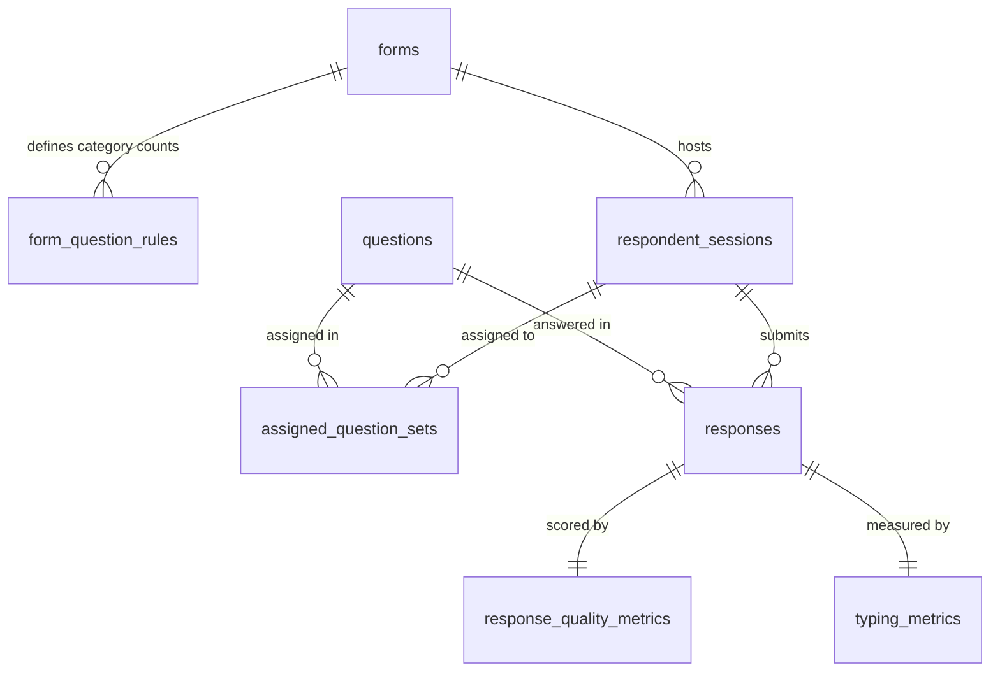

# Marathi Corpus Collection Platform (मराठी भाषा संग्रह)
## Comprehensive Architecture, Current State & Next-Phase Roadmap

> **Document Purpose**: This document provides an exhaustive, self-contained overview of what has been built in this repository and what is planned next. It is designed to be shared with other AI models (ChatGPT, Claude, etc.) or academic collaborators for design discussions, code reviews, and strategic feedback.

---

## 1. Executive Summary

- **Project Name**: Marathi Corpus Collection Platform (`marathi-corpus`)
- **Primary Goal**: Build an academic-grade data collection and evaluation platform for native Marathi text to train, fine-tune, and benchmark Large Language Models (LLMs).
- **Core Problem Solved**: Low-resource Indian languages suffer from poor-quality web-scraped data, excessive code-mixing, and machine translations. This platform collects clean, human-typed, dialect-annotated Marathi data with built-in anti-cheat and quality assurance mechanisms.
- **Publication Target**: Academic NLP/AI venues (e.g., ACL, EMNLP, LREC-COLING, IEEE/ACM TASLP) by providing both a **generative dialect corpus** and a **diagnostic evaluation benchmark**.

---

## 2. Technology Stack & Frameworks

| Component | Technology | Rationale / Details |
| :--- | :--- | :--- |
| **Framework** | Next.js 16 (App Router) + React 19 | Server/Client components, dynamic routes, Turbopack. |
| **Language** | TypeScript 5 | Strict typing throughout DB models, API payloads, and UI. |
| **Database & ORM** | Drizzle ORM + `@libsql/client` (SQLite / Turso) | Lightweight local development (`local.db`), serverless-ready for Turso cloud deployment. |
| **Authentication** | NextAuth.js v5 (`5.0.0-beta.32`) | JWT sessions, credentials provider for admin portal, protected via Edge `middleware.ts`. |
| **Styling & Design** | Tailwind CSS v4 + Base UI primitives | Curated academic blue-slate palette in OKLCH color space. Custom fonts (`Noto Serif Devanagari` & `Inter`). |
| **Visualization** | Recharts | Interactive admin dashboards (category distribution pie charts, 30-day area trends, bar charts). |
| **Validation** | Zod + React Hook Form | Strict schema validation on all API endpoints and frontend forms. |

---

## 3. What Has Been Built So Far (Current State)

### 3.1. Public Respondent System (`/f/[slug]`)
- **Dynamic Routing**: Forms are served via unique public slugs (e.g. `/f/marathi-pilot-2026`).
- **Participant Profile Collection (`MetadataForm`)**:
  - Gathers demographic & sociolinguistic data before questions start.
  - Covers all **36 Maharashtra districts** (Pune, Nagpur, Kolhapur, etc.) + outside Maharashtra.
  - Covers **8+ Marathi Dialects**: Standard Marathi (*प्रमाण मराठी*), Varhadi (*वऱ्हाडी*), Ahirani/Khandeshi (*खानदेशी*), Konkani (*कोकणी*), Malvani (*मालवणी*), Marathwada (*मराठवाडी*), Kolhapuri (*कोल्हापुरी*), Deshi (*देशी*).
  - Captures age group, gender, education level, occupation, and native speaker confirmation.
- **Seeded Random Question Assignment (`randomAssignment.ts`)**:
  - Assigns a reproducible set of questions per session based on form-configured category rules (e.g. 1 Opinion, 1 Experience, 1 Description).
  - Uses session-seeded pseudo-random shuffle to ensure fair question coverage and guarantee the same questions load if a user refreshes their mobile browser.
- **Word Progress Indicator (`WordProgressRing`)**:
  - Interactive SVG ring tracking real-time word count against the question's minimum word requirement.
- **Anti-Cheat & Integrity Controls**:
  - Blocks clipboard paste (`Ctrl+V`) and drag-and-drop actions into the text area.
  - Automatically logs every attempted paste event per session and per question.
- **Typing Dynamics Tracker**:
  - Measures total elapsed time, active typing duration, idle thinking duration, and real-time Words Per Minute (WPM).
- **Automated Linguistic Quality Checker (`checks.ts`)**:
  - Scores submissions from 0 to 100.
  - Flags trigram repetitive loops, consecutive character repeats (e.g. `aaaaaa`), predominantly English script ($>65\%$), and excessive numbers ($>50\%$).

### 3.2. Administrative Portal (`/admin`)
- **Dashboard (`/admin`)**: Real-time KPI summary cards (active questions, published forms, sessions, total responses).
- **Question Bank Manager (`/admin/questions`)**: Full CRUD interface with category filtering, difficulty levels (*easy, medium, hard*), word count limits, and a **bulk JSON importer**.
- **Form Builder (`/admin/forms`)**: Create collection forms, configure category allocation rules, toggle anti-paste/transliteration, set response caps, and publish/close forms.
- **Response Audit Viewer (`/admin/responses`)**: Review respondent text, sociolinguistic metadata, quality scores, flag reasons, paste attempt counts, and typing speeds.
- **Analytics Dashboard (`/admin/analytics`)**: Response distribution by category (Pie chart), 30-day submission trajectory (Area chart), and quality benchmark metrics.
- **Dataset Export Pipeline (`/admin/export`)**: One-click dataset exports in:
  - **CSV**: UTF-8 tabular format for Excel, Pandas, and R.
  - **JSON**: Full hierarchical dataset including metadata and typing metrics.
  - **JSONL**: Hugging Face `datasets` and LLM pre-training/fine-tuning standard.

---

## 4. Current Database Schema (8 Tables)

1. **`questions`**: `id`, `category`, `question`, `description`, `required`, `minWords`, `maxWords`, `difficulty`, `estimatedTime`, `enabled`, `tags`.
2. **`forms`**: `id`, `title`, `description`, `slug`, `isPublished`, `isClosed`, `transliterationEnabled`, `antiPasteEnabled`, `metadataConfig`, `questionsPerForm`, `maxResponses`.
3. **`form_question_rules`**: `id`, `formId`, `category`, `count`.
4. **`respondent_sessions`**: `id`, `formId`, `startedAt`, `submittedAt`, `userAgent`, `ipHash`, `metadata` (JSON), `pasteAttempts`.
5. **`assigned_question_sets`**: `id`, `sessionId`, `questionId`, `questionOrder`.
6. **`responses`**: `id`, `sessionId`, `questionId`, `responseText`, `wordCount`, `charCount`, `submittedAt`.
7. **`response_quality_metrics`**: `id`, `responseId`, `pasteAttempts`, `qualityScore`, `repeatedTextDetected`, `mostlyEnglish`, `mostlyNumbers`, `charRepetition`, `flagged`, `flagReason`.
8. **`typing_metrics`**: `id`, `responseId`, `totalDurationMs`, `activeDurationMs`, `idleDurationMs`, `wordsTyped`, `charsTyped`, `typingSpeedWpm`.

---

## 5. What We Are Implementing Next

### 5.1. Mobile-First Google Transliteration Keyboard (Gboard Style)

#### Objective
Enable mobile respondents to type phonetically in English (e.g., `kuthe` $\to$ `कुठे`, `namaskar` $\to$ `नमस्कार`, `kasa ahes` $\to$ `कसा आहेस`) without word translation (e.g., `where` will **not** become `कुठे`).

#### Architecture
1. **Server-Side API Proxy (`/api/transliterate`)**:
   - Queries Google Input Tools endpoint:
     `https://inputtools.google.com/request?text={word}&itc=mr-t-i0-und&num=5&cp=0&cs=1&ie=utf-8&oe=utf-8`
   - Bypasses browser CORS restrictions.
   - Built-in in-memory LRU caching so common Marathi words return in $<5\text{ms}$.
   - Automatic fallback to local phonetic rule generator if Google service is unreachable.
2. **Mobile UX & Keyboard Ergonomics**:
   - **Spacebar Auto-Commit**: Pressing Space, punctuation (`,`, `.`, `?`, `!`), or Enter automatically replaces the active English word with the top Marathi candidate.
   - **Sticky Horizontal Candidate Bar**: Positioned directly above the mobile virtual keyboard with large touch targets ($\ge 44\text{px}$).
   - **Native Devanagari Passthrough**: Auto-detects if a user is already typing in native Devanagari on their mobile keyboard (`/[\u0900-\u097F]/`), preventing double-transliteration.
   - **No Focus Loss**: Tapping candidate pills preserves the virtual keyboard focus via `onTouchStart={(e) => e.preventDefault()}`.
   - **Smart Backspace**: Hitting backspace immediately after a word conversion reverts it to the original English word for easy spelling correction.

---

### 5.2. Multi-Format Question Architecture (Academic Publication & Anti-Fatigue)

#### The Problem It Solves
Typing 3 long essays on a smartphone takes 8–12 minutes, leading to $>60\%$ respondent drop-off. Furthermore, pure open-ended text only evaluates text generation, leaving syntactic and grammatical benchmarks unaddressed.

#### Proposed 3.5-Minute Survey Flow
A gamified, fast-paced sequence per respondent:

| Step | Question Type | Time | Research & Publication Value |
| :--- | :--- | :--- | :--- |
| **1. Profile** | Demographics & Dialect | ~30 sec | Sociolinguistic stratification |
| **2. Task A** | **Word Choice / Cloze Test (MCQ)** | ~30 sec | **Lexical & Grammatical Diagnostic Benchmark** (evaluating case markers, inflections, idioms) |
| **3. Task B** | **Sentence Word Reordering (Interactive Chips)** | ~30 sec | **Syntactic & SOV Word-Order Benchmark** (evaluating clause structure comprehension) |
| **4. Task C** | **Focused Open-Ended Writing (1 Prompt)** | ~2 min | **High-Quality Generative Fine-Tuning Corpus** (natural dialect expression with word progress ring) |

**Total Completion Time**: ~3.5 to 4 minutes (drastically reduces drop-off while tripling completed sample size $N$).

---

## 6. Discussion Prompts for Other AI Models

When discussing this repository with ChatGPT, Claude, or other assistants, you can use the following targeted prompts:

### Prompt 1: Transliteration & Mobile IME Handling
> *"We are building a mobile web transliteration textarea in Next.js 16 for Marathi where typing phonetic Latin characters (e.g. 'kuthe') converts to Devanagari ('कुठे') upon pressing Space, using Google Input Tools API (`mr-t-i0-und`). What are the edge cases with mobile virtual keyboards (Android Gboard / iOS keyboard IME composition events, `beforeinput`, and `keyCode 229`), and how can we prevent focus loss when tapping candidate chips?"*

### Prompt 2: Linguistic Benchmark Design for Journal Papers
> *"We are designing a Marathi language dataset for an academic journal submission. We want to combine open-ended dialect text with Cloze (word choice) and Sentence Reordering tasks. What specific linguistic phenomena in Marathi (e.g., ergativity, Vibhakti pratyay, agreement with compound verbs, dialectal variations) should we target in our Cloze and Reordering questions to make the benchmark scientifically rigorous?"*

### Prompt 3: Data Quality & Evaluation Pipeline
> *"In our crowdsourced Marathi corpus platform, we track typing duration, active vs. idle time, paste attempts, and n-gram repetition. For an academic paper publication, what additional automated validation metrics (e.g., perplexity filtering with an Indic model, lexical diversity via TTR/MTLD, inter-annotator agreement) should we include in our data cleaning pipeline?"*
